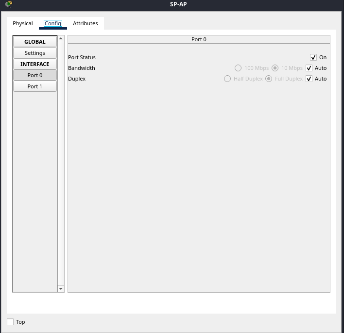
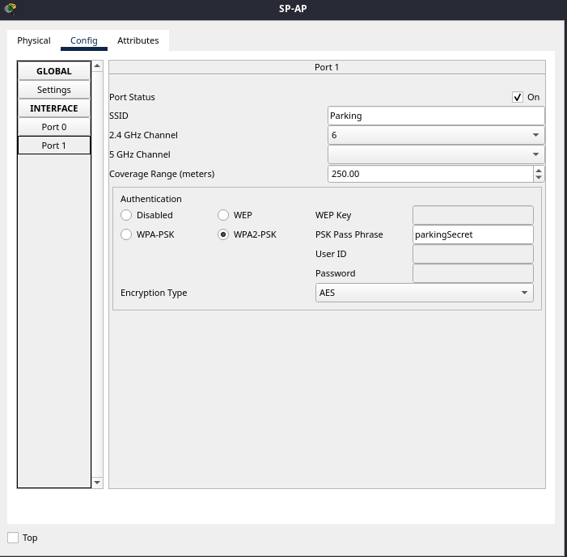
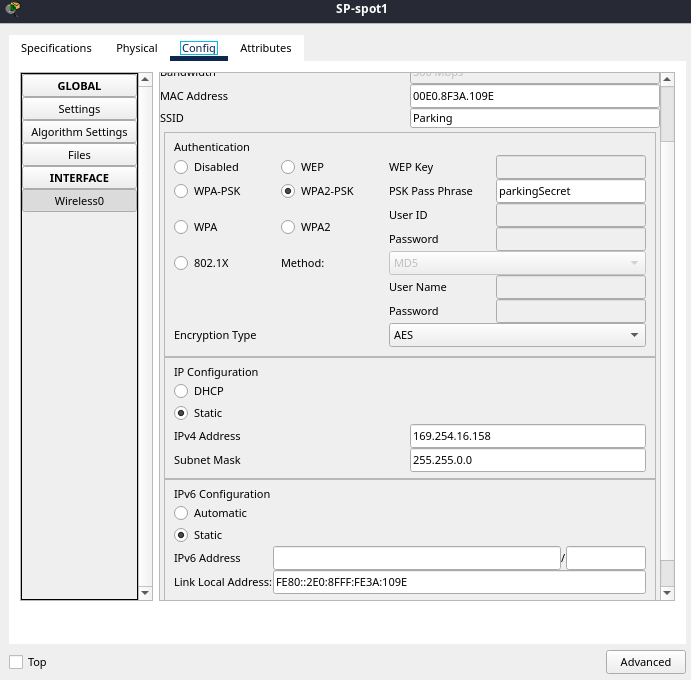
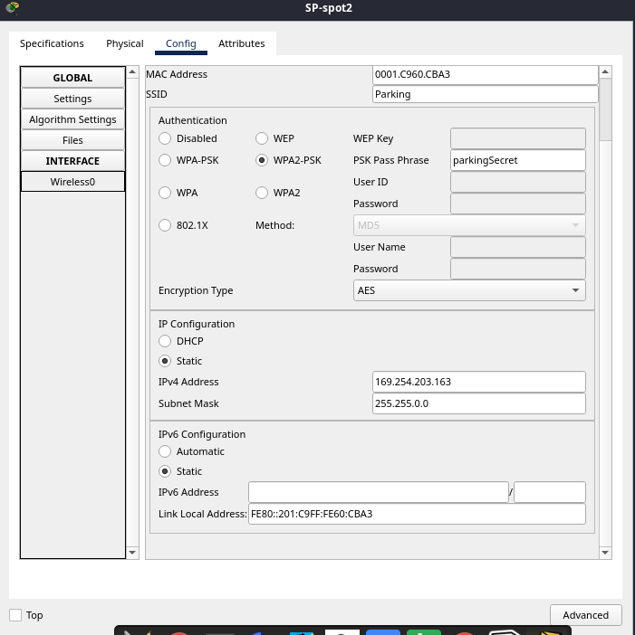
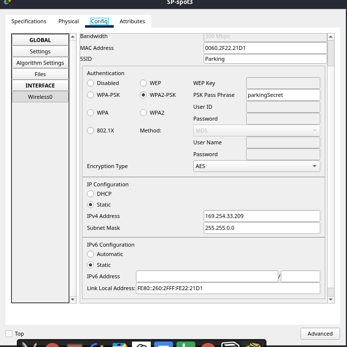
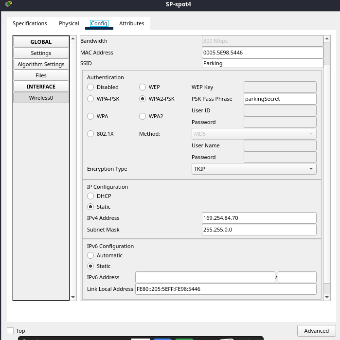
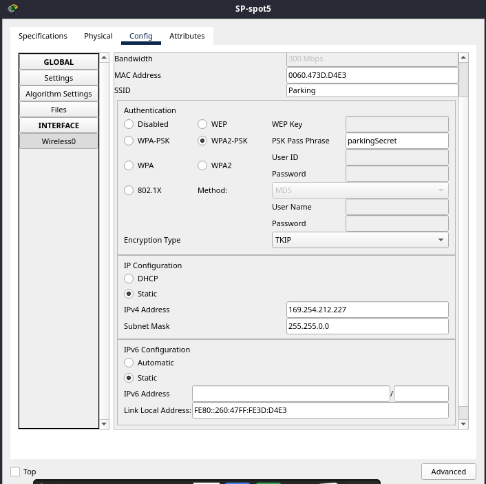
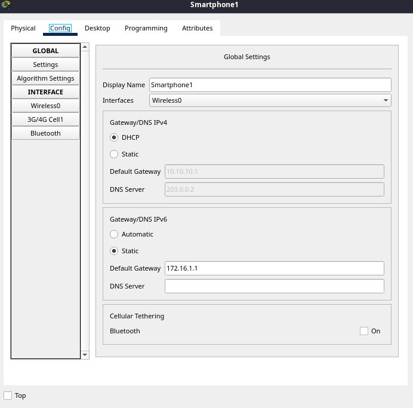
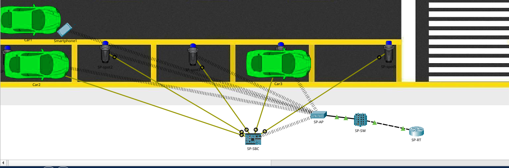
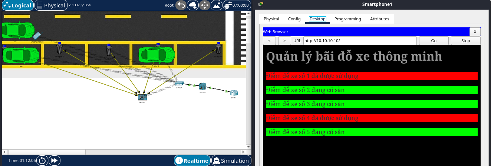

# IoT Smart Parking System
Use wireless metal sensors to track the presence of vehicles that communicate on Wi-Fi network and data is transmitted to SBC act as a parking central server
## Overview
The IoT Smart Parking System is a smart solution designed to optimize parking space management using wireless metal sensors and SBC. This system aims to enhance the efficiency of parking spaces in urban environments by providing real-time occupancy information by constantly updated information on a web browser via a web server address, and improving the overall parking experience for users.
## Key Features
* Real-Time Monitoring: Utilizes wireless metal sensors to detect the presence of vehicles in parking spaces and provide real-time occupancy updates.
* Centralized Management: Employs SBC as a central server to aggregate and process sensor data, serving an interactive web-based dashboard for users to view parking availability.
* User-Friendly Interface: Presents parking space status through a dynamic HTML interface that visually indicates occupied and available spaces.
* Scalable Architecture: Designed to easily scale with additional sensors and parking spaces, accommodating various sizes of parking facilities.
## Technologies Used
* SBC: SBC for handling sensor data and serving as the central server.
* Wireless Sensors: Metal sensors to detect vehicle presence and communicate wirelessly to the central server.
* Networking: Wi-Fi for connecting sensors to the central server and serving the web interface.
* Web Technologies: HTML, and JavaScript for creating the user interface and dynamically updating parking space status.
* Programming Languages: JavaScript for server-side logic and sensor data handling.
## How it works
1. Sensor Deployment: Metal sensors are installed in each parking space to detect the presence of vehicles. These sensors transmit data wirelessly.
2. Data Collection: The central SBC receives data from the sensors, processes it, and updates the parking space status.
3. User Interface: A web server running on the SBC serves an HTML page that displays the status of each parking space. The page is updated periodically to reflect real-time changes.
4. Visualization: The web interface uses color-coded indicators to show whether a parking space is occupied (red) or available (green), providing clear and immediate feedback to users.
## Prepare and setup components in Cisco Packet Tracer
### Router
In this project, I choose **819HGW** because it ensures these following requirements:
1. **Reliable Connectivity**
    - The 819HGW provides multiple connectivity options (Ethernet, 4G LTE) to ensure reliable and uninterrupted communication, which is crucial for real-time monitoring and control in this IoT smart parking system.
2. **Integrated Wi-Fi**
    - Built-in Wi-Fi allows wireless sensors and devices to connect to the network seamlessly, reducing the need for extensive cabling.
3. **Advanced Security**
    - With integrated security features, the 819HGW ensures that data transmitted between IoT devices and the central system is secure from unauthorized access and cyber threats.
4. **Remote Management**
    - The router supports remote management and monitoring, enabling administrators to manage the network and troubleshoot issues without being physically present.
5. **Scalability**
    - The 819HGW can support a scalable network infrastructure, allowing the parking system to grow and incorporate more sensors and devices over time.
6. **Support for IoT Protocols**
    - The router is capable of supporting various IoT communication protocols, ensuring compatibility with a wide range of IoT devices and sensors used in a smart parking system.
### Switch
In this project, I choose **IE-2000** because it ensures these following requirements:
1. **Rugged Design**
    - The IE-2000 series switches are built to withstand extreme temperatures, vibrations, and shocks, making them suitable for outdoor or industrial environments like a parking system.
2. **Flexible Deployment**
    - These switches offer a range of port configurations, including Fast Ethernet and Gigabit Ethernet options, which can support various device connections and bandwidth requirements.
3. **Advanced Security**
    - The IE-2000 switches provide advanced security features like port security, access control lists (ACLs), and secure management protocols to protect the network from unauthorized access and threats.
4. **Industrial Protocols**
    - Support for industrial automation protocols such as EtherNet/IP, PROFINET, and Modbus TCP, which are often used in IoT applications for integrating with various sensors and control systems.
5. **Power over Ethernet**
    - Some models support PoE, allowing the switch to power connected devices like cameras, sensors, and wireless access points, simplifying deployment and reducing the need for separate power supplies.
6. **Reliable Performance**
    - High availability features like redundant power inputs, ring topologies for network redundancy, and quality of service (QoS) to prioritize critical IoT traffic.
### MCU (SBC) or SBC (Single Board Computer)
In this project, I choose SBC Board because it brings off more power for data processing with more RAM and storage capacity than MCU Board, good scability for expanded systems and have more options for connectivity sometimes including cellular, can handle more complex communication protocols,etc
### Other Components
1. Access point (quantity=1): use **AccessPoint-PT-N** as the central hub for wireless communication namely Wi-Fi to other devices 
2. Metal sensor (quantity=5): each metal sensor is placed at each car slot
3. Smartphone (quantity=1): act as the terminal device of end-user
4. Car (quantity=3): act as a thing that occupies a parking slot
## Config devices
### SBC
I use JavaScript to program for the SBC, the code file can be found in the main of this project for more details 
### Router
```
Router>enable
Router#configure terminal
Router(config)#hostname SP-RT
SP-RT(config)# ip dhcp excluded-address 10.10.10.1
SP-RT(config)# ip dhcp excluded-address 10.10.10.10 10.10.10.10
SP-RT(config)# ip dhcp excluded-address 10.10.10.10
SP-RT(config)# ip dhcp pool ccp-pool
SP-RT(dhcp-config)# network 10.10.10.0 255.255.255.0
SP-RT(dhcp-config)# default-router 10.10.10.1
SP-RT(dhcp-config)# dns-server 203.0.0.2
```
### Others
### Access point


### Metal sensor





### Smartphone

## Topo and modeling

## Result

